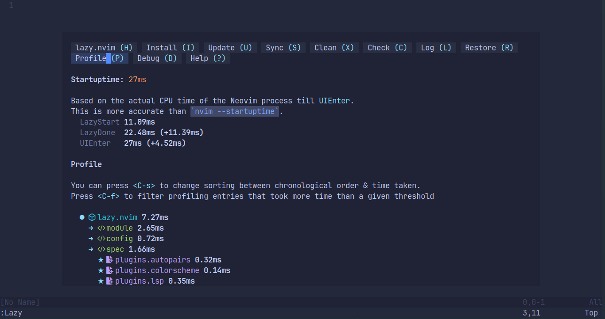

# This is my neovim config which loads blazingly fast!!! 
27 ms load times with lazy.nvim.
Use this if you are ShrilockHolmes or fork if you like my config
<
faster than NvChad on development machine!!

